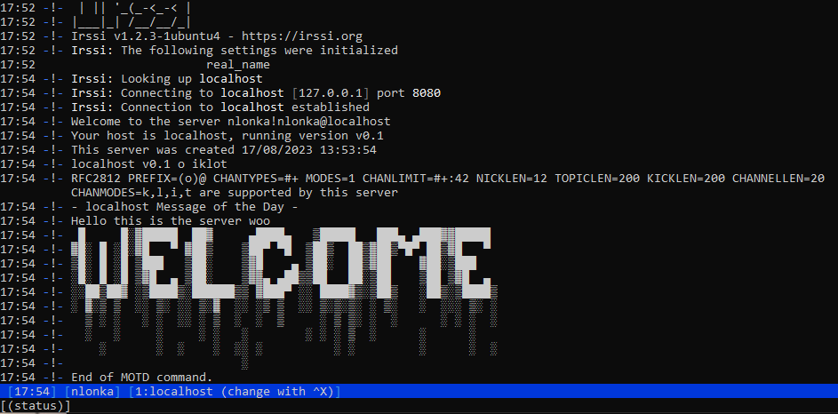
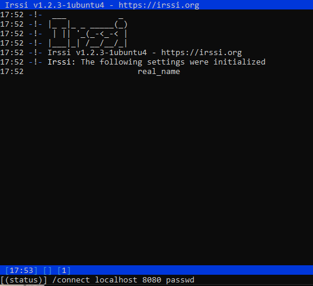
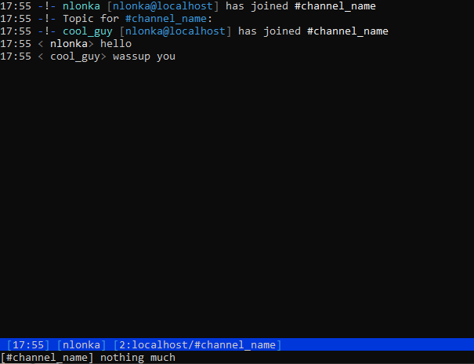
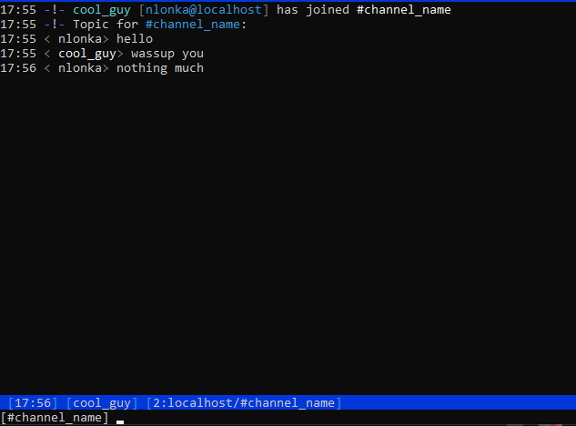

<a id="readme-top"></a>

<div align="center">
  <h2 align="center">ft_irc</h3>
</div>

<details>
  <summary>Table of Contents</summary>
  <ol>
    <li>
      <a href="#about-the-project">About the project</a>
    </li>
    <li>
      <a href="#getting-started">Getting started</a>
      <ul>
        <li><a href="#prerequisites">Prerequisites</a></li>
        <li><a href="#how-to-run-it">How to run it</a></li>
      </ul>
    </li>
    <li><a href="#usage">Usage</a></li>
      <ul>
        <li><a href="#supported-commands">Supported commands</a></li>
      </ul>
    <!--<li><a href="#roadmap">Roadmap</a></li>-->
  </ol>
</details>


<!-- ABOUT THE PROJECT -->
## About the project



This is an irc server implemented in C++. Supports at least the basic irc server functionalities such as authentication, joining channels, topics, sending files etc. 
This server was designed to work with irssi, so for the best experience use that client.


<!-- GETTING STARTED -->
## Getting started

This is how you might run this program locally.
Do note that it was originally made for a unix system, so your mileage may vary depending on your machine. 

### Prerequisites

As this program is coded in c++ you'll need a c++ compiler.
The server was made to work with irssi so that's the client I recommend to install

### How to run it

```
git clone https://github.com/Rubidium7/ft_irc.git
cd ft_irc
make && ./ircserv <port> <password> optional: debug
```
- port: the port number where the server will listen to incoming connections
- password: the password that the irc clients will need to put in to connect to the server
- debug: if you put this in it will make the program print out whatever the clients send (raw) and the server answers  

<!-- USAGE EXAMPLES -->
## Usage

if you run something like 
```
./ircserv 8080 localhost
```

you can connect to it like so from irssi:



to join a channel just:


then just message away:





_for more info on irssi usage you can check out [the irssi documentation](https://irssi.org/documentation/help/)_

### Supported commands
- Join
- Part
- Nick
- User
- Msg
- Topic
- Mode
- Invite
- Kick

<!-- ROADMAP -->
<!--## Roadmap

- [ ] Feature 1
- [ ] Feature 2
- [ ] Feature 3
    - [ ] Nested Feature -->


<p align="right">(<a href="#readme-top">back to top</a>)</p>
